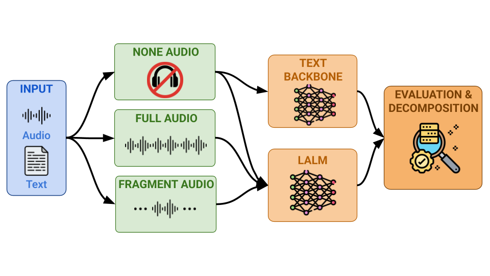
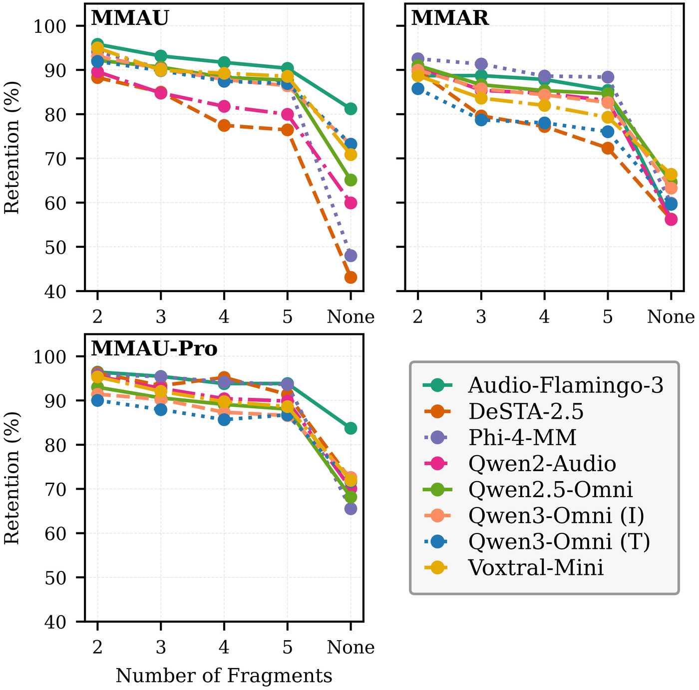
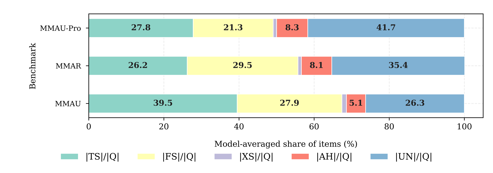

<div align="center">

# All That Glitters Is Not Audio
### Rethinking Text Priors and Audio Reliance in Audio-Language Evaluation

**Leonardo Haw-Yang Foo**\*, **Chih-Kai Yang**\*, Chen-An Li, Ke-Han Lu, Hung-yi Lee<br>
National Taiwan University · NTU AI-CoRE<br>
<sub>\* equal contribution</sub>

[](https://arxiv.org/abs/2604.24401)
[](https://github.com/leonardofhy/all-that-glitters-is-not-audio/releases/tag/v1.0)
[](LICENSE)



</div>

Large Audio-Language Models (LALMs) show consistent gains across speech and audio benchmarks, yet high
scores may not reflect auditory perception. We measure two axes: **text prior** — how much of a benchmark
is answerable from text and general knowledge alone — and **audio reliance** — how much of the acoustic
signal a model actually needs. Evaluating eight LALMs on MMAU, MMAR and MMAU-Pro, models retain 60–72% of
their full-audio scores without any audio input, and among items that require audio, only 3.0–4.2% need the
complete clip.

This repository contains the inference and evaluation code, the aggregate results behind every table and
figure in the paper, and the scripts that regenerate them.

## Framework

| Setting | Input to the model |
|---|---|
| **Full** | Audio and question |
| **None** | Question only; the audio input is omitted entirely (no silence placeholder) |
| **Text Backbone (TB)** | Question only, given to the LALM's text-only LLM backbone |
| **Fragment** (N ∈ {2, 3, 4, 5}) | Question and one of N equal-duration, contiguous fragments of the clip |

From these we compute the text-prior rate $`R_{\mathrm{TP}} = \mathrm{Acc}_{\mathrm{none}} / \mathrm{Acc}_{\mathrm{full}}`$,
the retention rate $`R_N`$ under N-way fragmentation, and a per-item decomposition into Text-Solvable (TS),
Fragment-Sufficient (FS), Cross-Segment (XS), Audio-Harmful (AH) and Unsolvable (UN) items.
Definitions are in Section 2 of the paper.

## Results

### Text prior

Accuracy (%) under the Full, None and Text-Backbone settings, with $`R_{\mathrm{TP}}`$ = None / Full.
MMAU-Pro covers its MCQ items. † MoE; 3B active parameters.

<table>
<thead>
<tr><th rowspan="2" align="left">Model</th><th rowspan="2">Size</th><th colspan="4">MMAU</th><th colspan="4">MMAR</th><th colspan="4">MMAU-Pro</th></tr>
<tr><th>Full</th><th>None</th><th>TB</th><th>R<sub>TP</sub></th><th>Full</th><th>None</th><th>TB</th><th>R<sub>TP</sub></th><th>Full</th><th>None</th><th>TB</th><th>R<sub>TP</sub></th></tr>
</thead>
<tbody>
<tr><td align="left">Audio-Flamingo-3</td><td>8.4B</td><td>75.0</td><td>60.9</td><td>45.5</td><td>81.2</td><td>58.8</td><td>33.1</td><td>35.3</td><td>56.3</td><td>52.7</td><td>44.1</td><td>31.2</td><td>83.7</td></tr>
<tr><td align="left">DeSTA-2.5</td><td>8.8B</td><td>65.2</td><td>28.1</td><td>28.4</td><td>43.1</td><td>46.4</td><td>26.1</td><td>26.2</td><td>56.2</td><td>43.5</td><td>31.3</td><td>20.3</td><td>72.0</td></tr>
<tr><td align="left">Phi-4-Multimodal</td><td>5.6B</td><td>60.4</td><td>29.0</td><td>28.9</td><td>48.0</td><td>46.1</td><td>27.6</td><td>28.3</td><td>59.9</td><td>43.7</td><td>28.6</td><td>29.9</td><td>65.5</td></tr>
<tr><td align="left">Qwen2-Audio-7B</td><td>8.2B</td><td>63.9</td><td>38.3</td><td>38.5</td><td>59.9</td><td>46.3</td><td>26.0</td><td>22.5</td><td>56.2</td><td>44.8</td><td>31.4</td><td>28.2</td><td>70.1</td></tr>
<tr><td align="left">Qwen2.5-Omni-7B</td><td>10.7B</td><td>74.8</td><td>48.7</td><td>45.5</td><td>65.1</td><td>63.9</td><td>41.3</td><td>35.3</td><td>64.6</td><td>57.7</td><td>39.3</td><td>31.2</td><td>68.2</td></tr>
<tr><td align="left">Qwen3-Omni (Instruct)</td><td>30B†</td><td>77.4</td><td>56.6</td><td>50.8</td><td>73.1</td><td>69.7</td><td>44.1</td><td>37.6</td><td>63.3</td><td>59.5</td><td>43.2</td><td>41.0</td><td>72.6</td></tr>
<tr><td align="left">Qwen3-Omni (Thinking)</td><td>30B†</td><td>76.2</td><td>55.8</td><td>38.6</td><td>73.2</td><td>70.3</td><td>41.9</td><td>31.6</td><td>59.6</td><td>56.5</td><td>40.5</td><td>33.8</td><td>71.7</td></tr>
<tr><td align="left">Voxtral-Mini-3B</td><td>4.7B</td><td>55.9</td><td>39.6</td><td>23.0</td><td>70.8</td><td>50.9</td><td>33.8</td><td>26.3</td><td>66.4</td><td>41.7</td><td>30.0</td><td>20.0</td><td>71.9</td></tr>
<tr><td align="left"><b>Average</b></td><td>–</td><td><b>68.6</b></td><td><b>44.6</b></td><td><b>37.4</b></td><td><b>65.1</b></td><td><b>56.5</b></td><td><b>34.2</b></td><td><b>30.4</b></td><td><b>60.5</b></td><td><b>50.0</b></td><td><b>36.0</b></td><td><b>29.5</b></td><td><b>72.1</b></td></tr>
</tbody>
</table>

### Audio reliance

<table>
<tr>
<td width="50%"></td>
<td width="50%"></td>
</tr>
<tr>
<td><sub><b>Retention rate</b> (%) as each clip is split into N fragments. Higher retention means more of the needed information survives in short fragments.</sub></td>
<td><sub><b>Item decomposition</b>, averaged over the eight models. Text-Solvable items dominate; Cross-Segment items, which need more than one fragment, are rare.</sub></td>
</tr>
</table>

Share of items that require audio (Audio-Needed = FS + XS), and how many of those need more than a single
fragment (Cross-Segment as a share of Audio-Needed), averaged over models:

| Benchmark | Audio-Needed (%) | Cross-Segment / Audio-Needed (%) | Range across models |
|---|:---:|:---:|:---:|
| MMAU | 29.1 | 4.2 | 2.2 – 5.7 |
| MMAR | 30.4 | 3.0 | 1.5 – 5.4 |
| MMAU-Pro | 22.2 | 4.0 | 2.1 – 8.0 |

All numbers above are produced by the scripts in this repository from the aggregate results in `results/`;
see [Reproducing the paper](#reproducing-the-paper).

## Repository layout

```
configs/generation_params.yaml   decoding parameters (greedy; temperature 0.6 for thinking models)
src/                             vLLM inference engine and config loading
scripts/mmau/ mmar/ mmau_pro/    per-benchmark inference runners and official scorers
scripts/run_text_backbone.py     text-backbone (TB) inference
scripts/retry_truncated.py       re-runs thinking-model outputs that hit the token limit
scripts/analysis/                LLM MCQ judge and score decomposition
scripts/paper/                   generators for the paper's tables and figures
scripts/rehydrate_results.py     restores benchmark fields into the released predictions
results/                         aggregate scores for every model, benchmark and condition
docs/                            reproduction and environment notes
```

## Reproducing the paper

Aggregate results for all models, benchmarks and conditions are included in `results/` (3.2 MB).
Regenerating the tables and figures needs only `numpy` and `matplotlib` (tested with Python 3.12):

```bash
pip install -r requirements.txt

python scripts/paper/generate_tables.py --latex          # text-prior table
python scripts/paper/generate_domain_table.py --latex    # accuracy by audio category
python scripts/paper/generate_retention_figures.py       # retention-rate curves
python scripts/paper/plot_table4_decomposition.py        # item decomposition
```

The audio-needed table is read from `results/decomposition_summary.json`, which
`scripts/analysis/compute_decomposition.py` computes from the per-item predictions below.
Recomputing the decomposition, re-scoring, and re-running inference are described in
[docs/reproduction.md](docs/reproduction.md); environments in [docs/environments.md](docs/environments.md).

## Released per-item predictions

Per-item model outputs and LLM-judge decisions for every model, benchmark and condition are distributed
as a separate archive (174 MB compressed, 810 files):

- Download: [predictions.tar.gz](https://github.com/leonardofhy/all-that-glitters-is-not-audio/releases/download/v1.0/predictions.tar.gz) · [SHA256SUMS](https://github.com/leonardofhy/all-that-glitters-is-not-audio/releases/download/v1.0/SHA256SUMS)
- SHA-256: `e13c7f274b62253fd14b82860e058c0de434304bc4f7bb065c9302c8b428890c`

The benchmarks are licensed CC BY-NC 4.0, so the archive does not contain their question text, choices or
answers. `scripts/rehydrate_results.py` re-joins those fields by item ID from the official Hugging Face
datasets, downloading metadata only (no audio).

## Evaluation protocol

MCQ items are scored with a hybrid judge: regular-expression answer extraction, falling back to
Claude Haiku 4.5 (temperature 0) when extraction fails (`scripts/analysis/llm_mcq_judge.py`).
MMAU-Pro open-ended and instruction-following items use the benchmark's original evaluation
(`scripts/mmau_pro/evaluate.py`).

Exact model and dataset identifiers, and their licenses, are listed in [THIRD_PARTY.md](THIRD_PARTY.md).

## Citation

```bibtex
@article{foo2026glitters,
  title   = {All That Glitters Is Not Audio: Rethinking Text Priors and Audio Reliance in Audio-Language Evaluation},
  author  = {Foo, Leonardo Haw-Yang and Yang, Chih-Kai and Li, Chen-An and Lu, Ke-Han and Lee, Hung-yi},
  journal = {arXiv preprint arXiv:2604.24401},
  year    = {2026}
}
```

## License

The code is released under the MIT License ([LICENSE](LICENSE)). The released results are derived from
benchmarks distributed under CC BY-NC 4.0 and from third-party model outputs; see
[THIRD_PARTY.md](THIRD_PARTY.md) for the terms that apply to them.
